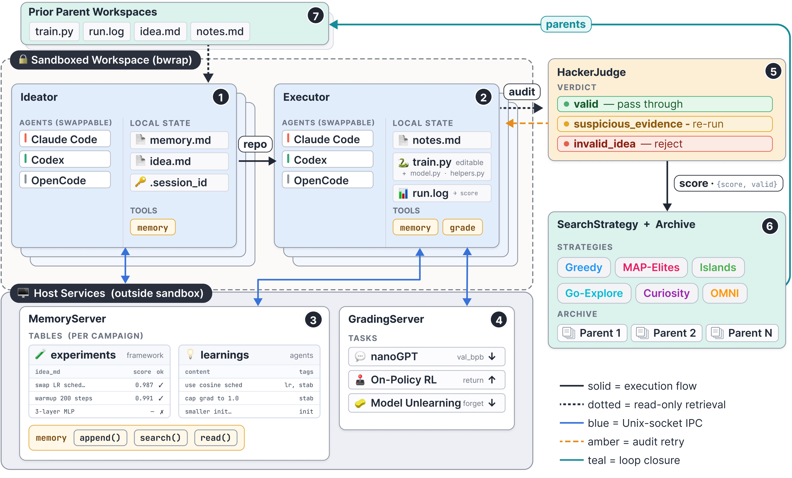
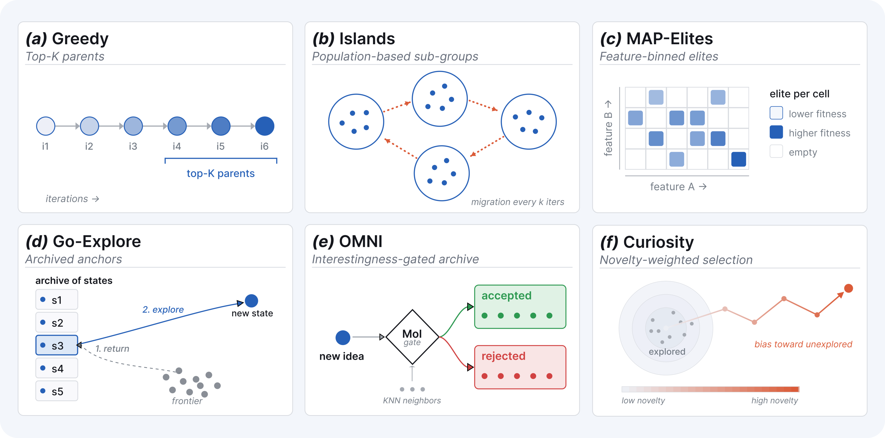

<p align="center"></p>

<p align="center"><strong>A powerful framework for implementing AI research agent flows</strong></p>

<p align="center">
  <a href="https://arxiv.org/abs/2606.25198"></a>
  <a href="https://huggingface.co/datasets/woanderer/paper-runs"></a>
  <a href="LICENSE"></a>
</p>

Heuresis is built on a set of primitives that can be easily composed in a loop to allow fully-agentic AI Research workflows using different coding agents ([OpenCode], Claude, Codex) and search strategies.



<p align="center"><em>Ideator and executor agents run in a <a href="https://github.com/containers/bubblewrap">bubblewrap</a> (<code>bwrap</code>) sandbox and search classes control search over ideas/executions, closing the loop.</em></p>

## Highlights

- **Swappable coding agents.** [OpenCode], Claude, and Codex sit behind one `AgentProfile` interface; pick the backend per run with a CLI flag.
- **Decoupled, fully-agentic ideator and executor.** An ideator proposes a repo-level change, an executor implements and runs it. Many ideator/executor pairs run asynchronously in parallel.
- **Pluggable search.** Six search strategies, from a greedy baseline to quality-diversity methods (plus a `curiosity_plus` variant), all driven by the same loop contract and a thin per-task adapter.
- **Global and local memory.** A shared memory store records framework experiments and agent-authored learnings, queryable by semantic KNN or SQL.
- **`HackerJudge` reward-hacking audit.** A tri-state verdict audits each workspace for fabricated results, optionally triggering an agent-free re-grade.
- **[bubblewrap] (`bwrap`) sandbox.** Filesystem, network, and PID isolation with GPU control and hardlinked per-run venvs.
- **Quality/Diversity/Novelty analysis skill.** A shipped, agent-driven pipeline (`.agents/skills/heuresis-analyzing-search-runs/`) that scores runs on quality, diversity, and novelty — the tooling behind the paper's results, usable from Claude Code or Codex.

## From the Paper

Heuresis is the framework behind our study of how search shapes autonomous ML
research. Across **9,000 runs (3,222 scored)** on three domains, we find that
search **steers where ideas land** on the quality, diversity, and novelty axes
but **does not expand the quality--novelty frontier**: no ML/AI research idea was rated
"Original", and the rare novel ideas never approach the top known-recipe scores.
The `HackerJudge` was necessary to keep the search faithful, catching **40
confirmed fabrications across 1,628 scored runs**.

Please see `CITATION.cff` to cite the work.

## Quickstart

```bash
# 1. Install the development environment
uv sync --extra dev

# 2. Configure credentials
cp .env.example .env
${EDITOR:-vi} .env

# 3. Optional: check host support for sandboxed GPU experiments
bash scripts/check.sh
```

Real runs need a configured coding agent, the API keys it uses, and (for
[NanoGPT]) GPUs. [NanoGPT] also needs the small training shard cache:

```bash
bash scripts/setup.sh nanogpt
opencode models   # for OpenCode; use your agent's model-list command otherwise
MODEL=your-model-id
uv run heuresis nanogpt linear --gpus 0 --num-iterations 10 --model "$MODEL" --no-memory --disable-judge
```

The minimal smoke command above disables memory and judge calls so it only
requires the selected executor model. Omit `--no-memory` and `--disable-judge`
for full campaigns after configuring the Gemini and judge-agent credentials
those features require. Replace `your-model-id` with one of the model IDs
listed by your agent CLI. On hosts with a small or full default cache
filesystem, set `UV_CACHE_DIR` before running `uv` commands, for example
`export UV_CACHE_DIR=/tmp/uv-cache-$USER`.

## Core Primitives

The agentic loop above is assembled from a small set of composable primitives.
Each numbered component in the figure maps to one place in the package:

| # | Primitive | Role | Symbol |
| --- | --- | --- | --- |
| 1 | Ideator | Proposes a repo-level code change | `heuresis.ideate()` |
| 2 | Executor | Implements and runs the change | `heuresis.execute()` |
| - | Harness | Runs ideator/executor pairs async in parallel | `heuresis.Harness` |
| 3 | MemoryStore | Stores experiments + agent learnings (KNN or SQL) | `heuresis.memory.MemoryStore` |
| 4 | GradingServer | Scores a finished run | `heuresis.GradingServer` |
| 5 | HackerJudge | Audits the workspace, emits a tri-state verdict | `heuresis.HackerJudge` |
| 6 | SearchStrategy | Updates its archive, selects the next parents | `heuresis.qd.SearchStrategy` |

The ideator and executor (1, 2) run on a swappable agent backend
(`heuresis.agent.AgentProfile`): [OpenCode], Claude, or Codex.

## Search Strategies

Each search strategy is a self-contained loop in `src/heuresis/loops/`, built on
the quality-diversity algorithms in `src/heuresis/qd/` and driven by a thin
per-task adapter in `src/heuresis/tasks/<task>/adapter.py`.



| Strategy | Idea |
| --- | --- |
| `linear` | Top-K parents by score, no archive. The baseline. |
| `map_elites` | Cell-targeted MAP-Elites over a discretized feature grid. |
| `go_explore` | MAP-Elites with score/visit-weighted cell sampling. |
| `islands` | Parallel island populations with ring migration. |
| `curiosity` / `curiosity_plus` | Prediction-error-driven exploration. `curiosity_plus` is a variant of `curiosity`. |
| `omni_epic` | Model-of-Interestingness-gated open-ended search. |

## Tasks

Tasks live in `src/heuresis/tasks/<task>/`. The three canonical tasks are the
domains from the paper; `bbob` is a lightweight CPU benchmark useful for quick
local checks.

| Task | Domain | Metric | Notes |
| --- | --- | --- | --- |
| `nanogpt` | [NanoGPT] pretraining | `val_bpb` (lower is better) | GPU; needs the training shard cache (`bash scripts/setup.sh nanogpt`). |
| `discogen_onpolicyrl` | On-Policy RL | `score` (higher is better) | GPU; requires the optional [DiscoGen] extra. |
| `discogen_modelunlearning` | Model Unlearning | `score` (higher is better) | GPU; requires the optional [DiscoGen] extra. |
| `bbob` | Black-box optimization benchmark | `mean_log_gap` (lower is better) | CPU-only, no extra. |

A run pairs one task with one strategy and is launched with the `heuresis` CLI,
which dispatches to the strategy loop:

```bash
uv run heuresis <task> <strategy> [flags]
uv run heuresis --launch-config configs/experiments/<task>/<strategy>.yaml
```

Defaults (GPUs, iterations, model, and the [DiscoGen] `--config` / `--domain`)
come from the registry and launch configs; any flag overrides them. Model names
are agent/provider-specific, so pass `--model` explicitly when moving between
agent CLIs or provider accounts. The two [DiscoGen] tasks need the optional extra, e.g.
`uv run --extra discogen heuresis discogen_onpolicyrl linear`. The legacy
`discogen` task name remains as an On-Policy RL compatibility alias. For long runs, pipe to a log
(`uv run heuresis nanogpt linear … 2>&1 | tee logs/run.log`) or use tmux. See
`docs/experiments.md` for launch details.

## Analyzing Runs (Quality / Diversity / Novelty)

The `.agents/skills/heuresis-analyzing-search-runs/` skill is the multi-phase
pipeline (extract → classify → verify → aggregate → figures) that scores runs on
quality, diversity, and novelty — the tooling behind the paper's results.
Novelty is rubric-driven (e.g. the Gupta & Pruthi 2025 originality rubric);
classification and verification spawn parallel sub-agents.

It ships as an agent skill usable from Claude Code or Codex with the same
invocation — point the agent at the skill and a run directory:

```
Follow .agents/skills/heuresis-analyzing-search-runs/SKILL.md to analyze <run_dir>
```

Pass two run directories to compare them. The deterministic phases are plain
scripts you can also run directly, e.g.
`uv run python .agents/skills/heuresis-analyzing-search-runs/scripts/extract_run.py <run_dir>`.

## Repository Layout

| Area | Purpose |
| --- | --- |
| `src/heuresis/` | Core package: workspace setup, harness, stores, graders, memory, settings, and CLI. |
| `src/heuresis/qd/` | Quality-diversity algorithms: archives, selection, metrics, migration, and the search strategies. |
| `src/heuresis/loops/` | Per-strategy experiment loops, one task-agnostic file per strategy. |
| `src/heuresis/tasks/` | Per-task assets and runtime: graders, prompts, seed files, requirements, and adapters. |
| `configs/experiments/` | Per-(task x strategy) launch configs in YAML, resolved by the `heuresis` CLI. |
| `scripts/` | Convenience launchers, setup checks, smoke checks, and analysis helpers. |
| `.agents/skills/` | Shipped agent skills (Claude + Codex). Includes the quality/diversity/novelty analysis pipeline. |
| `docs/` | Public user and contributor documentation. |
| `analysis/` | Research and paper artifact tooling. Scripts may require external run data. |
| `runs/` | Local experiment outputs. Gitignored except for the directory README. |
| `maintainer/` | Maintainer-only operating notes and archived historical docs. Not part of the public API. |

## Documentation

Start with `docs/README.md`. The main public guides are:

- `docs/getting-started.md`: install, credentials, first run, host checks.
- `docs/concepts.md`: how workspaces, harnesses, tasks, strategies, stores, and sandboxes fit together.
- `docs/experiments.md`: direct entry points, wrappers, CLI flags, and live smokes.
- `docs/add-task.md`: how to add a new task family.
- `docs/add-strategy.md`: how to add a new search algorithm.
- `docs/configuration.md`: credentials, CLI config, API key precedence, and runtime environment variables.
- `docs/dependencies.md`: `pyproject.toml`, extras, task requirements, `uv.lock`, and sandbox venvs.
- `docs/troubleshooting.md`: common setup, sandbox, auth, GPU, and live smoke issues.
- `docs/reference.md`: compact public API overview.

## API Keys

Supported credential variables are `GEMINI_API_KEY`, `GEMINI_API_KEYS`,
`GOOGLE_GENERATIVE_AI_API_KEY`, `OPENAI_API_KEY`, `ANTHROPIC_API_KEY`, and
`HF_TOKEN`. Set whichever your chosen agent and task require in `.env`. Do not
commit `.env` or key files.

Heuresis loads repo-local `.env` files with `python-dotenv`; you do not need to
source `.env` from Bash.

Experiment behavior is configured with CLI flags, not environment variables.
Credentials and low-level runtime settings are the only expected environment
configuration.

## Development

```bash
uv sync --extra dev
uv run python -m pytest tests/ -q
uv run ruff check src/heuresis tests scripts
```

`ty` is available as an advisory type checker. The full repository is not yet a
`ty`-clean CI gate, but edited modules should be checked when practical.

## Citation

If you use Heuresis, please cite the paper:

```bibtex
@misc{antoniades2026heuresis,
  title  = {Heuresis: Search Strategies for Autonomous AI Research Agents Across Quality, Diversity and Novelty},
  author = {Antonis Antoniades and Deepak Nathani and Ritam Saha and Alfonso Amayuelas and Ivan Bercovich and Zhaotian Weng and Vignesh Baskaran and Kunal Bhatia and William Yang Wang},
  year   = {2026},
  eprint = {2606.25198},
  archivePrefix = {arXiv},
  primaryClass = {cs.AI},
  url    = {https://arxiv.org/abs/2606.25198}
}
```

GitHub's "Cite this repository" also reads `CITATION.cff`, which points to the
same paper.

## License

This repository uses split licensing:

- Code is released under the Apache License 2.0. See `LICENSE`.
- Paper/manuscript text is released under Creative Commons
  Attribution-NonCommercial-NoDerivatives 4.0 International
  (`CC-BY-NC-ND-4.0`). See `LICENSE-PAPER`.
- Released run artifacts and dataset metadata are released under Creative
  Commons Attribution-NonCommercial 4.0 International (`CC-BY-NC-4.0`). See
  `LICENSE-DATA`.

[bubblewrap]: https://github.com/containers/bubblewrap
[DiscoGen]: https://github.com/AlexGoldie/discogen
[NanoGPT]: https://github.com/karpathy/nanoGPT
[OpenCode]: https://opencode.ai/
